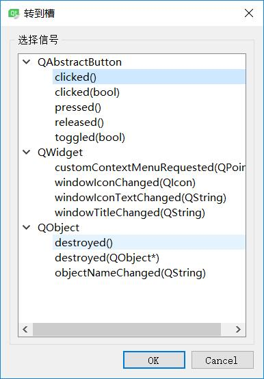
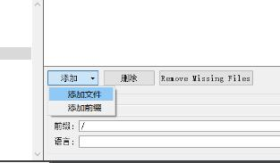
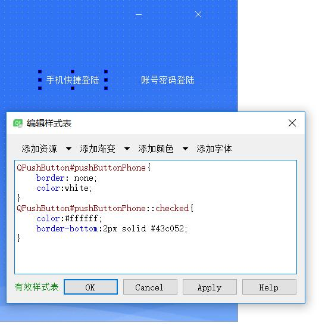

# 登陆界面LoginDemo #
**采用的基类是QDialog**

**.qss样式表文件：样式表就是各种控件的衣服**

qss样式路径E:\tanzhou\TZKT\resources\ui\qss\login_widget_ui

QWidget#wdLoginFrom{
border-image: url(./resources/ui/skin/12anniversary/dlbg.png);
}

看到这个url里面的资源图片

 **加载这个图片的做法：**

在同一目录下创建image文件夹 在文件夹下继续创建png文件夹 将png图片存入  同时还可以创建一个ico文件夹用于存放图标

dlbg.png的分辨率为317X491

**添加资源文件**

**1.右键项目--add new**

**2.创建资源文件夹**

**3.选择添加前缀(只保留/)**

**4.选择添加文件**

**5.qMake一下，把资源加载进来，选择border-image**

## 控件布局流程 ##

**1.添加两个pushbutton按钮**

关闭按钮的对象名称WClose,最小化WHide

**2.为两个按钮添加槽函数**

**3.最小化函数接地**

**4.给最小化和关闭添加图标**
	
以下是qss样式表

    	QPushButton#btnMin
    {
    	border:none;
    	image: url(./resources/ui/skin/LoginPic/zxh.png);
    }
    	
    
    	QPushButton#btnQuit
    {
    	border:none;
    	image: url(./resources/ui/skin/LoginPic/shut.png);
    }

**5.继续添加资源**

把图标添加进去

qmake一下

	
[重要]需要修正背景窗口的样式表作用域,右键主Dialog修改样式表,这样的好处是规定了作用域是QDialog

对应控件qss以后采用编码方式，可以通过添加资源加载路径，然后放在QPushButton作用域里面

    	QPushButton
    {
    	border: none;
    	image: url(:/image/png/shut.png);
    }
    
    	QPushButton:hover
    {
    	background-color: #3e72cb;
    }

    	QPushButton
    {
    	border: none;
    	image: url(:/image/png/zxh.png);
    }
    
    	QPushButton::hover
    {
    	background-color: #3e72cb;
    }

**6.通过Label控件添加图片**

	改变对象名字为labelLogo
	
	

**7.登陆方式框**

设立两个按钮，分别为pushButtonPhone和pushButtonAccount

    QPushButton#pushButtonPhone{
    	border: none;
    	color:white;
    }
    QPushButton#pushButtonPhone::checked{
    	color:#ffffff;
    	border-bottom:2px solid #43c052;
    }

    QPushButton#pushButtonAccount{
    	border: none;
    	color:white;
    }
    QPushButton#pushButtonAccount::checked{
    	color:#ffffff;
    	border-bottom:2px solid #43c052;
    }

**[重要]**两个pushButton进行编组

两个按钮分别勾选属性checkable、autoExclusive
首选手机登陆增加checked属性

这样就形成了这样的效果

**8.分页窗口stacked widget**

编辑QStackedWidget

