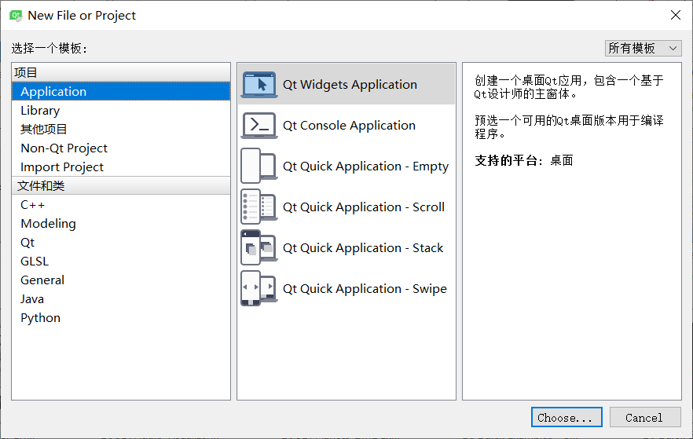
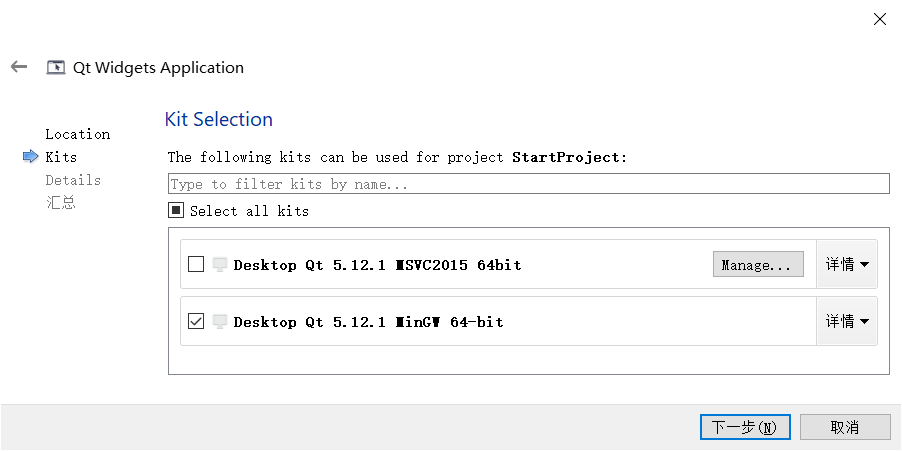
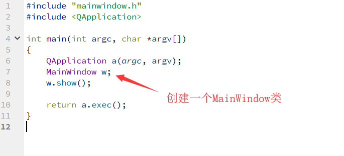

# Qt New a project #

开始建立一个项目：

选择编译器：

Qwidget代码结构

main.cpp代码结构

    #include "mainwindow.h"
    #include <QApplication>
    
    int main(int argc, char *argv[])
    {
    QApplication a(argc, argv);
    MainWindow w;//构建一个MainWindow类
    w.show();//显示w这个类
    
    return a.exec();
    }

mainwindow.cpp代码结构

    #include "mainwindow.h"
    #include "ui_mainwindow.h"
    
    MainWindow::MainWindow(QWidget *parent) :
    QMainWindow(parent),//QMainWindow是一个基类
    ui(new Ui::MainWindow)
    {
    ui->setupUi(this);
    }
    
    MainWindow::~MainWindow()
    {
    delete ui;
    }

